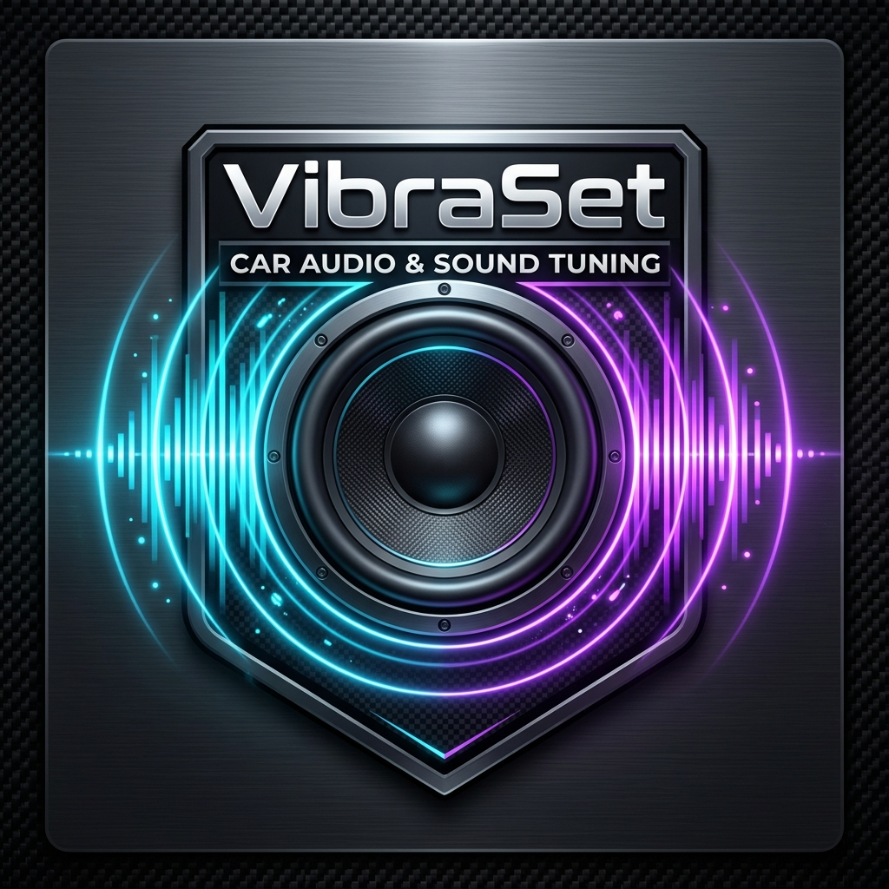

# VibraSet

<p align="center">
  
</p>

<p align="center">
  <strong>Ecualizador y configurador de audio profesional para Android.</strong>
</p>

<p align="center">
  
  
  
  
  
  
</p>

---

## 🎵 Descripción

**VibraSet** es una aplicación integral diseñada para entusiastas del sonido, instaladores de car audio y audiófilos que buscan el máximo rendimiento de sus sistemas de sonido en vehículos y sistemas de audio domésticos (mini componentes, barras y monitores de estudio).

Combina una consola de procesamiento de señal digital (DSP), ecualizador multibanda (10, 15 y 31 bandas), analizador de espectro de frecuencias RTA en tiempo real, vúmetros estéreo de alta respuesta dinámica, ajuste de subgraves con corte subsónico/crossover y un motor inteligente de calibración acústica (**Auto-Set**).

---

## ⚡ Características Principales

- **Ecualizador Profesional Multibanda**:
  - Modos conmutables de **10 bandas** (estándar), **15 bandas** (2/3 de octava) y **31 bandas** (1/3 de octava) con control de ganancia de ±12 dB por banda.
  - Curvas de compensación simétricas e interpolación fluida.
- **Analizador de Espectro RTA (Real-Time Analyzer)**:
  - Visualización FFT de 64 bandas espectrales con detección de caídas dinámicas (peak decay).
  - Vistas conmutables de Barras Digitales, Curva Analógica Neón y Espectrograma por cascada.
- **Rack de Control de Tono y Subwoofer**:
  - **Bass Boost & Subwoofer Gain** con refuerzo en frecuencias sub-graves (30 Hz - 80 Hz).
  - **Crossover Subwoofer / Low-Pass Filter** ajustable (50 Hz - 250 Hz).
  - **Filtro Subsónico** para protección de conos de subwoofer.
  - **Filtro de Agudos (Treble Clarity)** y control de apertura espacial estéreo.
- **Auto-Set (Calibración Acústica Asistida)**:
  - Ajuste automatizado con perfiles acústicos optimizados para: *SPL / Bajos Fuertes (Open Show)*, *Calidad de Sonido (SQ Audiophile)*, *Voz y Medios Claros* o *Respuesta Plana de Referencia*.
- **Vúmetros Estéreo L/R**:
  - Medición dinámica de pico de señal estéreo en tiempo real con indicador LED de saturación (Clip Warning).
- **Perfiles de Instalación de Audio**:
  - *Car Audio - SPL / Open Show*
  - *Car Audio - Sound Quality (SQ)*
  - *Mini Componente / Equipo Doméstico*
  - *Monitores de Estudio / Referencia*
  - *Audífonos de Alta Fidelidad*
- **Gestión de Presets de Sonido**:
  - Presets de fábrica integrados (Flat, Car Audio Bass, Punchy Kick, Rock & Guitars, Electronic Club, Voice Clarity, Acoustic SQ).
  - Guardado, carga y eliminación de presets personalizados en almacenamiento local.
- **Reproductor de Audio Integrado**:
  - Permite probar y afinar la ecualización en tiempo real sin salir de la app, con selector de pistas y control de transporte.

---

## 🚀 Estado Actual del Desarrollo

- **Versión**: `1.0.0`
- **Estado**: Estable y completamente operativo.
- **Pruebas**: Verificación de compilación y suites de pruebas unitarias locales con Robolectric superadas exitosamente.
- **Compatibilidad**: Probado para ejecución fluida en teléfonos, pantallas de infoentretenimiento de vehículos (Android Auto / Car Head Units) y tabletas en formato apaisado y vertical.

---

## 🛠️ Tecnologías Utilizadas

- **Lenguaje**: Kotlin 2.2.10
- **Interfaz de Usuario**: Jetpack Compose con Material Design 3 (M3)
- **Diseño Adaptativo**: Soporte para pantallas compactas, intermedias y extendidas (Tablets / Car Consoles)
- **Efectos de Audio**: Android AudioEffect APIs (`Equalizer`, `BassBoost`, `Virtualizer`, `Visualizer`)
- **Persistencia de Datos**: Room Database & Data Layer local para presets de usuario y configuraciones
- **Concurrencia**: Kotlin Coroutines & StateFlow / SharedFlow
- **Inyección de Dependencias**: Inyección por constructor con arquitectura MVVM
- **Automatización**: Gradle Kotlin DSL (`build.gradle.kts`), Version Catalogs (`libs.versions.toml`) y GitHub Actions CI

---

## 📱 Requisitos

- **Dispositivo**:
  - Android 7.0 (API nivel 24) o superior.
  - Se recomienda Android 10 (API nivel 29) o superior para un rendimiento óptimo de las APIs de visualización de audio.
- **Permisos**:
  - `RECORD_AUDIO`: Requerido exclusivamente para la captura de frecuencias FFT del espectro RTA en tiempo real (no se graba ni almacena audio).
  - `MODIFY_AUDIO_SETTINGS`: Requerido para la aplicación de efectos DSP en la sesión de audio.
- **Entorno de Compilación**:
  - JDK 21 (Temurin / OpenJDK recomendado).
  - Android SDK Platform 36.

---

## 📦 Estructura del Proyecto

```text
VibraSet/
├── .github/
│   └── workflows/
│       └── android.yml             # Workflow de Integración Continua en GitHub Actions
├── app/
│   ├── build.gradle.kts            # Configuración del módulo Android
│   ├── src/
│   │   ├── main/
│   │   │   ├── AndroidManifest.xml # Manifiesto con permisos y actividades
│   │   │   ├── java/com/example/
│   │   │   │   ├── MainActivity.kt # Actividad principal y arranque
│   │   │   │   ├── ui/theme/       # Sistema de temas, colores y tipografía
│   │   │   │   └── vibraset/
│   │   │   │       ├── audio/      # Motor de procesamiento de audio y DSP
│   │   │   │       ├── data/       # Repositorio y base de datos Room
│   │   │   │       ├── model/      # Modelos de datos (Presets, Bandas, Perfiles)
│   │   │   │       └── ui/         # Pantallas, ViewModel y componentes Compose
│   │   │   └── res/
│   │   │       ├── drawable/       # Recursos gráficos vectoriales y logo oficial
│   │   │       ├── mipmap-*/       # Iconos de la aplicación en todas las densidades
│   │   │       └── values/         # Cadenas (strings.xml), colores y temas
│   │   └── test/                   # Pruebas unitarias con Robolectric
├── art/                            # Recursos de identidad visual para documentación
│   └── vibraset_logo.jpg           # Logo oficial de VibraSet
├── gradle/
│   ├── libs.versions.toml          # Catálogo centralizado de versiones
│   └── wrapper/                    # Gradle Wrapper binario y configuración
├── build.gradle.kts                # Configuración raíz de Gradle
├── settings.gradle.kts             # Módulos y repositorios del proyecto
└── README.md                       # Documentación principal del proyecto
```

---

## 💻 Compilación y Generación del APK

### 1. Clonar el repositorio
```bash
git clone https://github.com/tu-usuario/VibraSet.git
cd VibraSet
```

### 2. Otorgar permisos al Gradle Wrapper
```bash
chmod +x gradlew
```

### 3. Compilar el proyecto
```bash
./gradlew compileDebugSources
```

### 4. Generar el APK de depuración (app-debug.apk)
```bash
./gradlew assembleDebug
```
El archivo APK generado estará disponible en:
```text
app/build/outputs/apk/debug/app-debug.apk
```

### 5. Generar APK de Release (si se configuran variables de firma)
```bash
./gradlew assembleRelease
```
El archivo APK estará disponible en:
```text
app/build/outputs/apk/release/app-release.apk
```

---

## 🤖 GitHub Actions

El repositorio incluye un flujo de trabajo automatizado en `.github/workflows/android.yml` que:
1. Se activa automáticamente con cada `push` o `pull_request` a las ramas `main` o `master`.
2. Permite ejecución manual mediante **Run workflow** (`workflow_dispatch`) desde la pestaña *Actions* de GitHub.
3. Configura el entorno con JDK 21 y el SDK de Android.
4. Otorga permisos de ejecución al Gradle Wrapper.
5. Limpia el proyecto y ejecuta la compilación de `assembleDebug`.
6. Publica el APK resultante como un **Artifact** descargable listo para probar en dispositivos reales.

---

## 📸 Capturas de Pantalla

> *Sección preparada para incorporar capturas de pantalla de la aplicación ejecutándose en dispositivos reales y sistemas de sonido de vehículos.*

| Pantalla Principal (Consola DSP) | Ecualizador y Auto-Set | Analizador RTA y Vúmetros |
|:---:|:---:|:---:|
| *(Captura pendiente)* | *(Captura pendiente)* | *(Captura pendiente)* |

---

## 👤 Autor

- **Nombre**: Luis Miguel Martínez Cabrera
- **Proyecto**: VibraSet - Ecualizador y configurador de audio profesional para Android
